# Poesiamo — UML Diagrams

Diagrams converted from the Visual Paradigm project `Poesiamo.vpp` to [Mermaid](https://mermaid.js.org/), rendered natively by GitHub.

## Contents

- **Use Case Diagram**
  - [UCDiagram](#ucdiagram)
- **Class Diagrams**
  - [CD](#cd)
  - [CD-Project](#cd-project)
  - [Boundary](#boundary)
  - [Controller](#controller)
  - [Entity](#entity)
  - [Database](#database)
  - [CDRefined](#cdrefined)
- **Sequence Diagrams**
  - [sdGenerateReport](#sdgeneratereport)
  - [sdGenerateReportProject](#sdgeneratereportproject)
  - [sdPublishPoemsProject](#sdpublishpoemsproject)
  - [sdViewStatisticsProject](#sdviewstatisticsproject)
  - [sdViewStatistics](#sdviewstatistics)
  - [sdPublishPoem](#sdpublishpoem)
- **Deployment Diagram**
  - [Deployment Diagram](#deployment-diagram)

## Use Case Diagram

### UCDiagram

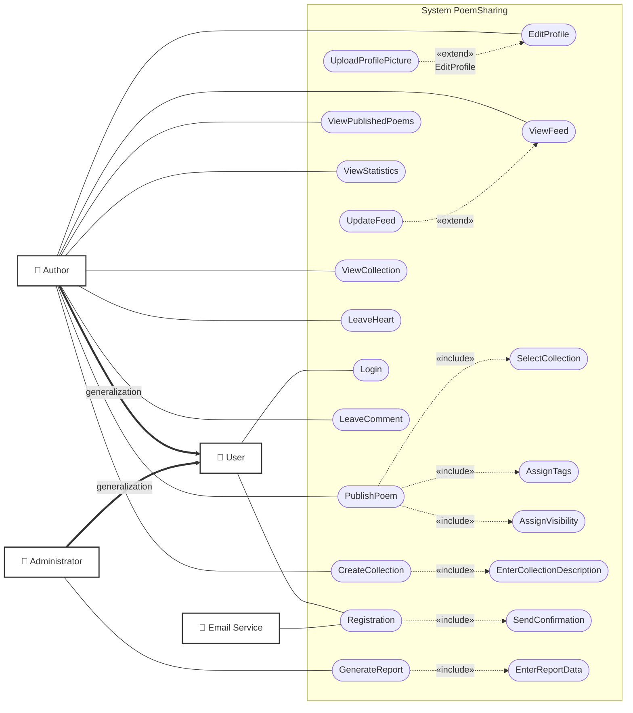

## Class Diagrams

### CD

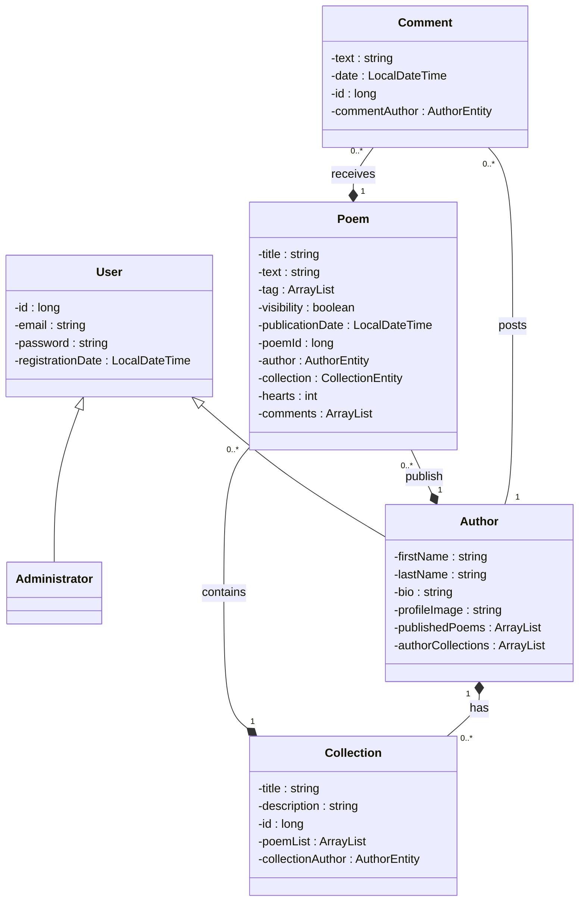

### CD-Project

```mermaid
classDiagram
    direction TB
    namespace pkg_Controller {
        class Controller {
            <<Singleton>>
            +registerAuthor()
            +loginAuthor()
            +loginAdministrator()
            +logout()
            +publishPoem()
            +viewStatistics()
            +giveHeart()
            +commentPoem()
            +generatePoemsInRangeReport()
            +generateActiveAuthorsReport()
            +generateMostUsedTagsReport()
            +generateMostInteractedPoemsReport()
        }
    }
    namespace pkg_Boundary {
        class UserBoundary {
            +logout()
        }
        class AdministratorBoundary {
            +showPoemReportDialog()
            +generateMostActiveAuthorsReport()
            +generateMostUsedTagsReport()
            +generateMostInteractedPoemsReport()
        }
        class AuthorBoundary {
            +createStatisticsPanel()
            +createPublishPanel()
        }
    }
    namespace pkg_Entity {
        class User {
            -id : long
            -email : string
            -password : string
            -registrationDate : LocalDateTime
            +registerUser() boolean
            +login() boolean
            +updateProfile() boolean
            +deleteAccount() boolean
        }
        class Comment {
            -text : string
            -date : LocalDateTime
            -id : long
            -commentAuthor : AuthorEntity
            +createComment() boolean
            +editComment() boolean
            +deleteComment() boolean
            +viewComment() string
        }
        class Poem {
            -title : string
            -text : string
            -tag : ArrayList
            -visibility : boolean
            -publicationDate : LocalDateTime
            -poemId : long
            -author : AuthorEntity
            -collection : CollectionEntity
            -hearts : int
            -comments : ArrayList
            +addHeart() boolean
            +addComment() boolean
            +getLastThreeComments() ArrayList
            +editPoem() boolean
            +deletePoem() boolean
            +changeVisibility() boolean
            +hasTag() boolean
            +getCommentCount() int
            +getInteractionCount() int
        }
        class Author {
            -firstName : string
            -lastName : string
            -bio : string
            -profileImage : string
            -publishedPoems : ArrayList
            -authorCollections : ArrayList
            +publishPoem() long
            +viewFeed() ArrayList
            +giveHeart() boolean
            +commentPoem() boolean
            +viewStatistics() string
        }
        class Administrator {
            +viewAllUsers() ArrayList
            +viewAllAuthors() ArrayList
            +deleteUser() boolean
            +generatePoemsInRangeReport() void
            +generateActiveAuthorsReport() void
            +generateMostUsedTagsReport() void
            +generateMostInteractedPoemsReport() void
        }
        class Collection {
            -title : string
            -description : string
            -id : long
            -poemList : ArrayList
            -collectionAuthor : AuthorEntity
            +addPoem() boolean
            +removePoem() boolean
            +editCollection() boolean
            +deleteCollection() boolean
            +getPoemCount() int
            +getMostLikedPoem() PoemEntity
            +getSortedPublicPoems() ArrayList
            +searchPoemsByTitle() ArrayList
            +viewCollection() void
        }
    }
    namespace pkg_Database {
        class CommentDAO {
            +createComment() boolean
            +readComment() void
            +updateComment() void
            +deleteComment() void
        }
        class CollectionDAO {
            +createCollection() long
            +readCollection() void
            +updateCollection() void
            +deleteCollection() void
            +readPoemList() void
        }
        class DBConnectionManager {
            -conn : Connection
            +getConnection() Connection
            +closeConnection() void
            +selectQuery(query : string) ResultSet
            +updateQuery(query : string) int
            +updateQueryReturnGeneratedKey(query : string) Integer
            +selectQueryWithParams(query : string, params : Object) ResultSet
        }
        class UserDAO {
            +createUser() boolean
            +updateUser() boolean
            +deleteUser() boolean
        }
        class PoemDAO {
            +createPoem() boolean
            +readPoem() void
            +readAuthor() void
            +readCollection() void
            +readComments() void
            +updatePoem() boolean
            +deletePoem() boolean
            +addHeart() void
            +addComment() boolean
            +getTotalHeartsByAuthor() int
            +getTotalCommentsByAuthor() int
            +getTopPoemByAuthor() PoemDAO
        }
        class AdministratorDAO {
            -generatePoemsInRangeReport() void
            -generateMostActiveAuthorsReport() void
            -generateMostUsedTagsReport() void
            -generateMostInteractedPoemsReport() void
        }
        class AuthorDAO {
            +readAuthor() void
            +readPublishedPoemList() void
            +readAuthorCollectionList() void
        }
    }
    CommentDAO ..> DBConnectionManager : «use»
    CollectionDAO ..> DBConnectionManager : «use»
    PoemDAO ..> DBConnectionManager : «use»
    UserDAO <|-- AuthorDAO
    UserDAO <|-- AdministratorDAO
    UserDAO ..> DBConnectionManager : «use»
    User <|-- Administrator
    User <|-- Author
    Poem "0..*" --* "1" Author : publish
    Comment "0..*" --* "1" Poem : receives
    Poem "0..*" --* "1" Collection : contains
    Author "1" *-- "0..*" Collection : has
    Comment "0..*" -- "1" Author : posts
```

Package dependencies:

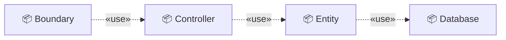

### Boundary

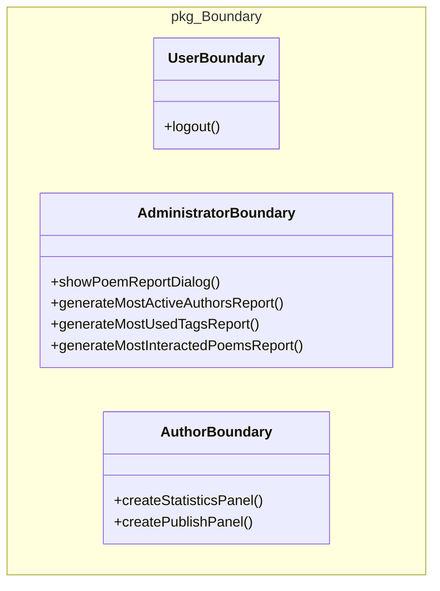

### Controller

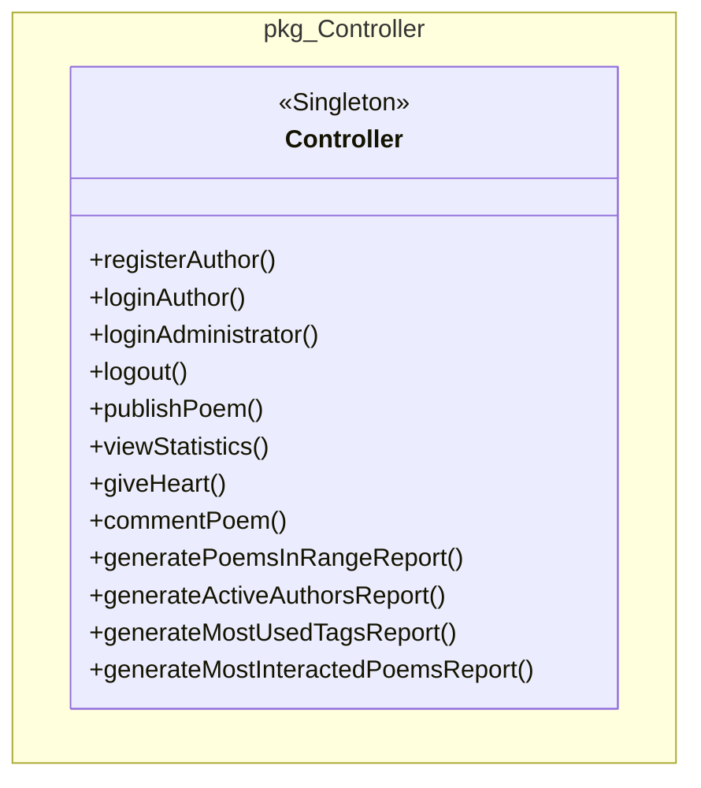

### Entity

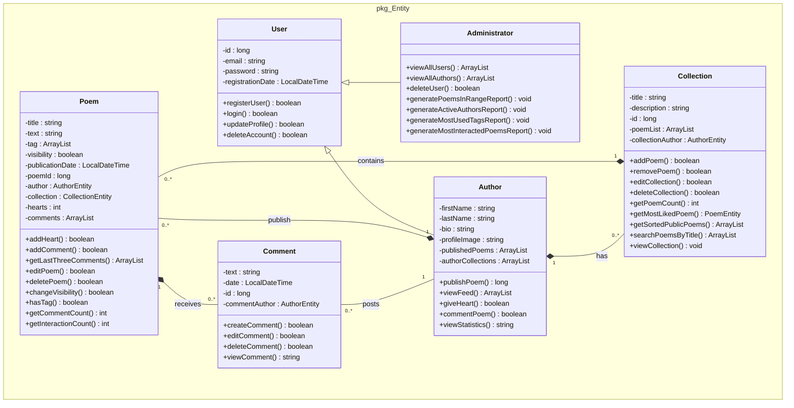

### Database

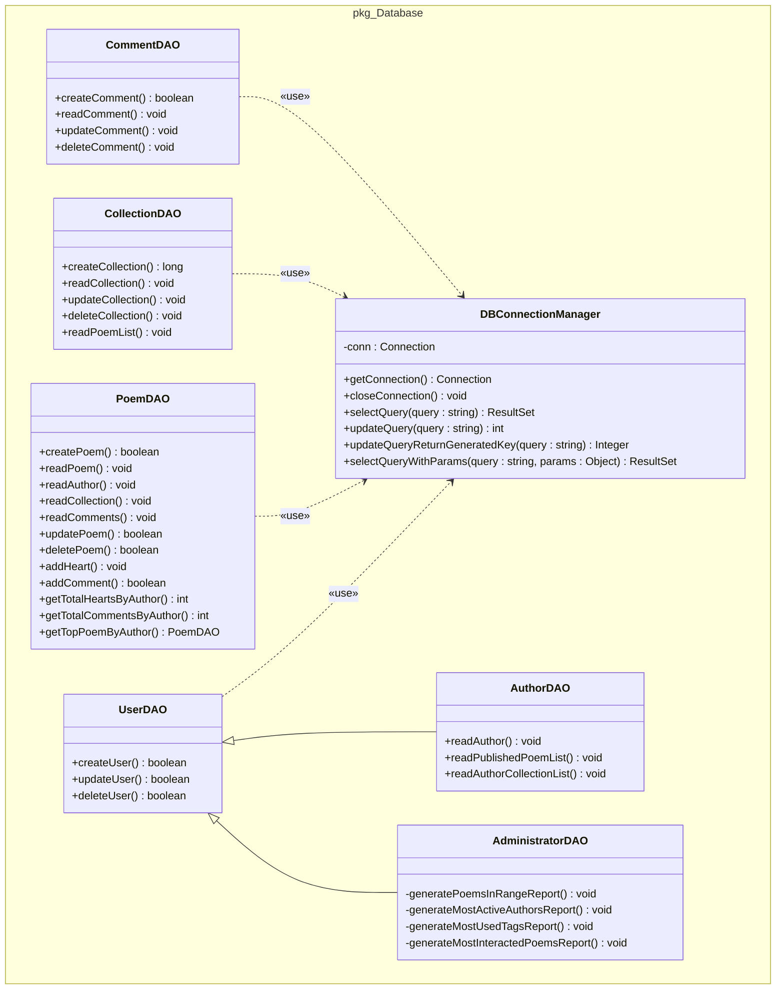

### CDRefined

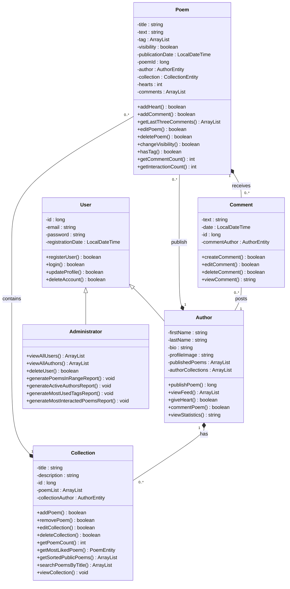

## Sequence Diagrams

### sdGenerateReport

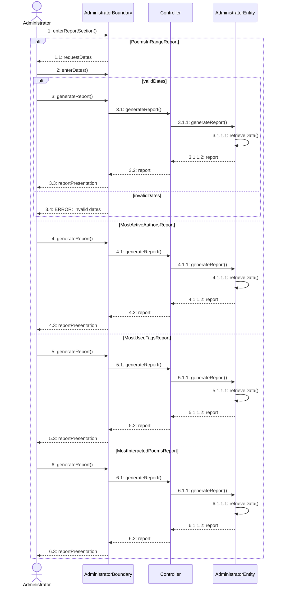

### sdGenerateReportProject

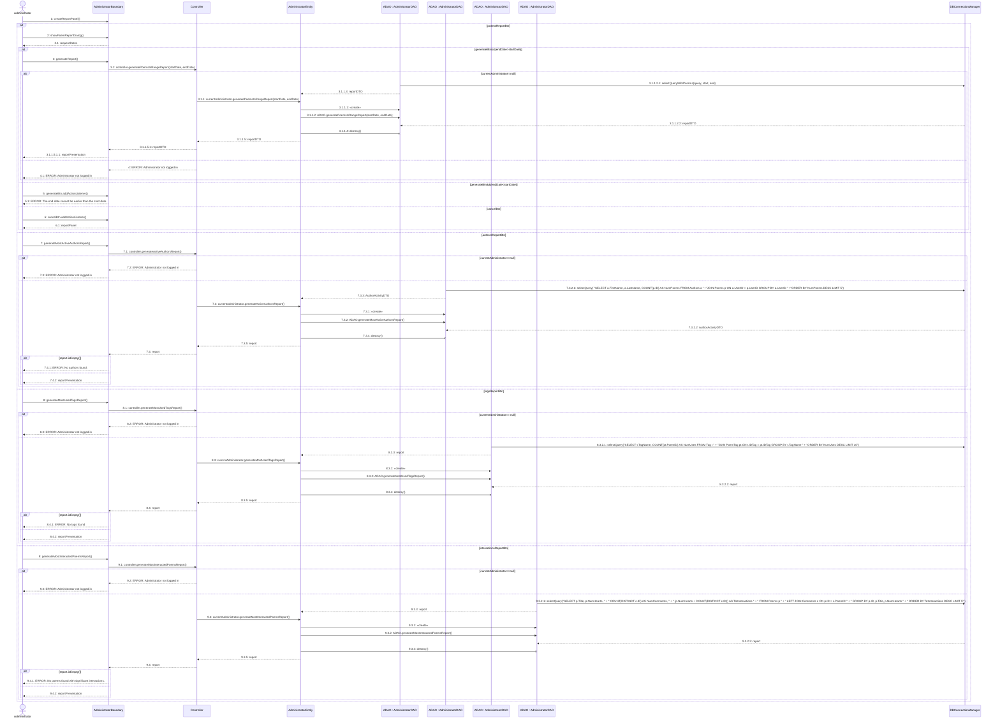

### sdPublishPoemsProject

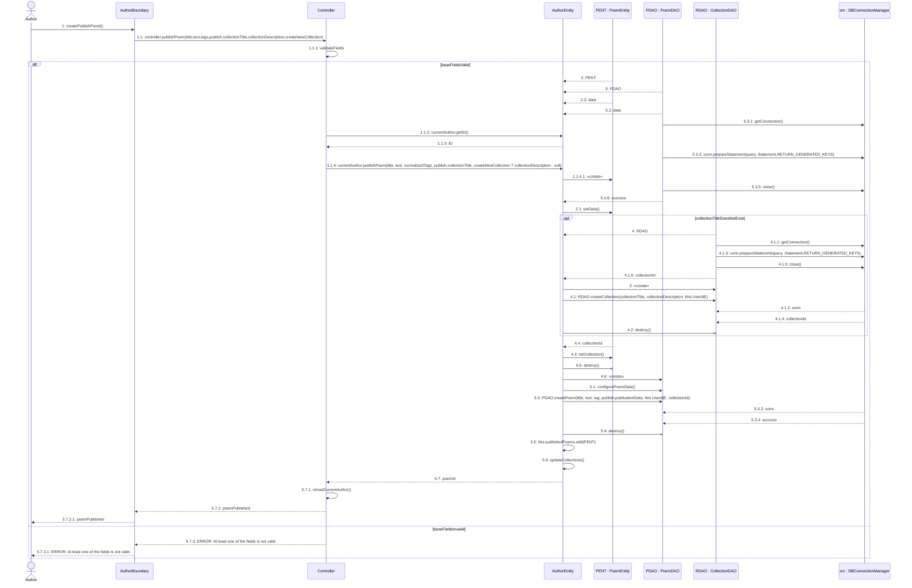

### sdViewStatisticsProject

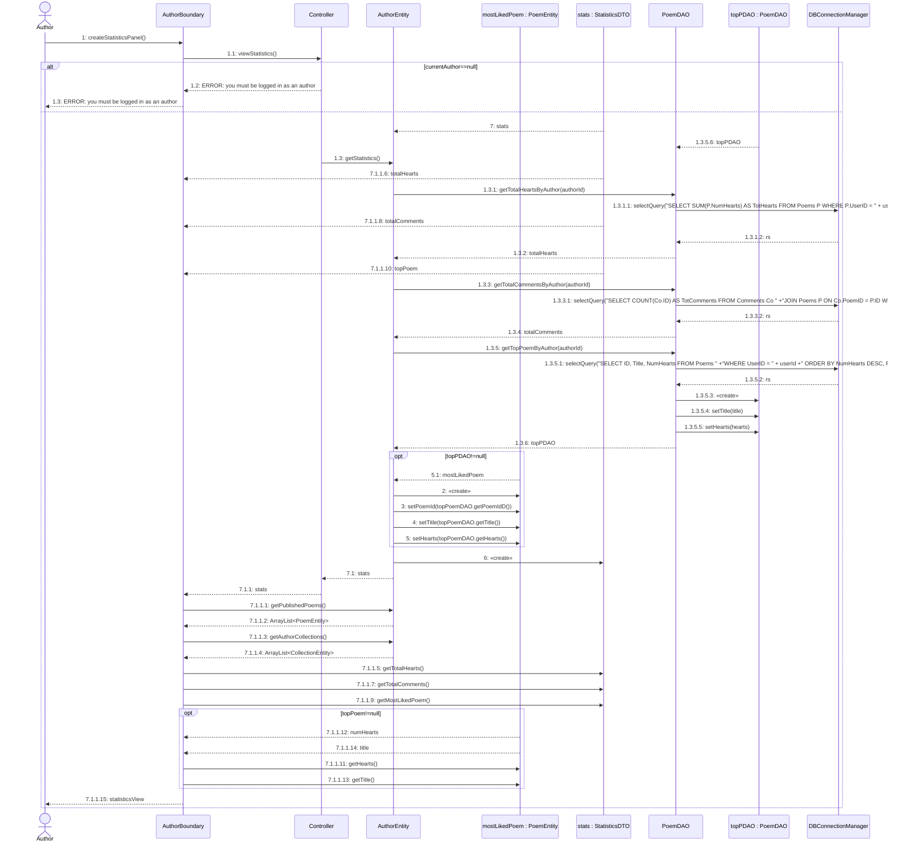

### sdViewStatistics

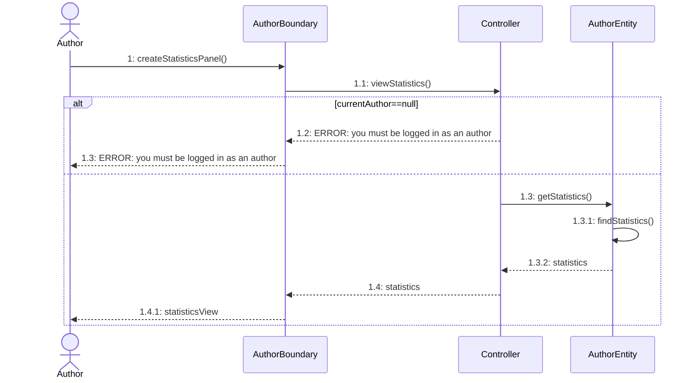

### sdPublishPoem

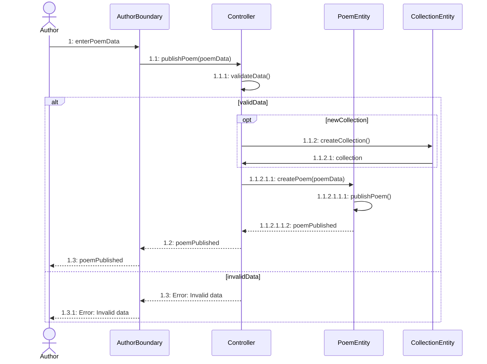

## Deployment Diagram

### Deployment Diagram

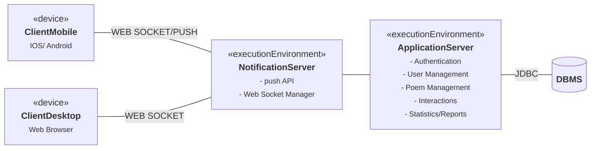
